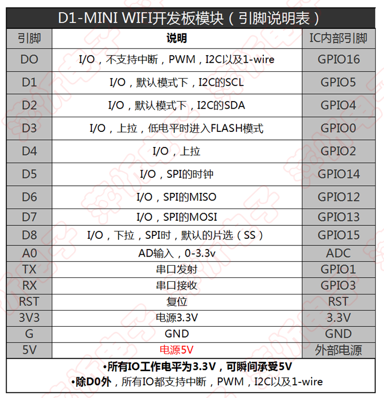

# 硬件介绍

## 实物展示
实物展示图如下：  

## 结构图

说明：
- AC-DC 模块用于提供5V直流电源，给wifi模组和继电器使用。
- ESP8266 的IO口输出驱动能力有限，搭配三极管驱动电路，驱动继电器。
- 继电器选用磁保持继电器，优点是只有在改变继电器状态时才需要驱动电流，常开和常关时均不需要控制电流，降低功耗。
- AC-DC 模块使用接线板自带的开关控制，非必须，这样可以选择关闭控制模块，仍按照普通接线板使用。

## 硬件列表

#### esp8266模组
mini D1 基于ESP8266 开发板。

wifi模组，支持简单的http协议，可以通过IO口控制硬件。

[购买链接](https://detail.tmall.com/item.htm?id=537012923975&spm=a1z09.2.0.0.146e2e8djPbwfF&_u=djreddb51f4)

引脚图：

#### AC-DC模块
封装好的220V转5V模块，直接使用。

[购买链接](https://detail.tmall.com/item.htm?id=526376083444&spm=a1z09.2.0.0.67002e8dQsKVvh&_u=djreddb777b)

#### 磁保持继电器
用于最终控制220V的通断。

[购买链接](https://item.taobao.com/item.htm?spm=a1z09.2.0.0.67002e8dQsKVvh&id=522809751138&_u=djreddb28f8)
